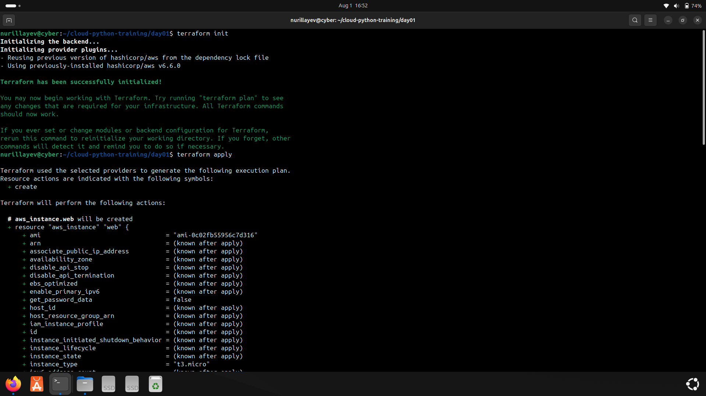
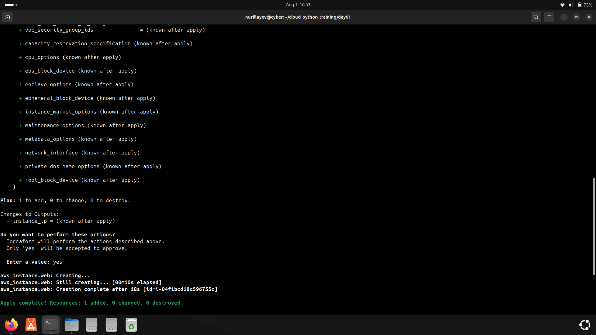
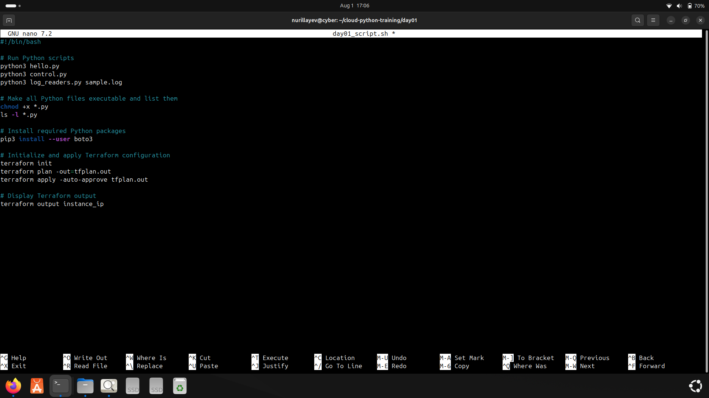

# Day 1 – AWS Terraform + CLI Automation

### 🎯 Objective

The goal of Day 1 was to practice cloud automation using Terraform and AWS CLI.

---

### 🔧 Tools & Technologies

- Terraform
- AWS CLI
- Bash
- EC2

---

### 🛠️ Commands Used

#### Terraform Commands
- `terraform init` – Initialize working directory with provider plugins  
- `terraform plan` – Preview infrastructure changes  
- `terraform apply` – Apply changes and deploy infrastructure  
- `terraform destroy` – Tear down the infrastructure (optional)

---

### 🧪 Practical Tasks

- Configured provider block in `main.tf` with region: `us-east-1`
- Defined EC2 resource using AMI `ami-0c02fb55956c7d316` and instance type `t3.micro`
- Initialized Terraform environment using `terraform init`
- Deployed EC2 instance using `terraform apply`
- Retrieved public IP address from Terraform outputs
- Created a Bash script to automate basic AWS CLI tasks
- Described running EC2 instances using CLI

---

### 📜 Script

[`day01_script.sh`](./day01_script.sh): Contains some used commands .

---

### 🖼️ Screenshots

#### 1. Terraform Initialization  
**Command:** `terraform init`  

#### 2. EC2 Instance Deployment  
**Command:** `terraform apply`  

#### 3. Script Creation  
**Command:** Script written using `nano` and saved as `day01_script.sh`  

---

### ✅ Status

All Terraform and AWS CLI tasks were completed and verified successfully via the AWS Console and command-line outputs.

